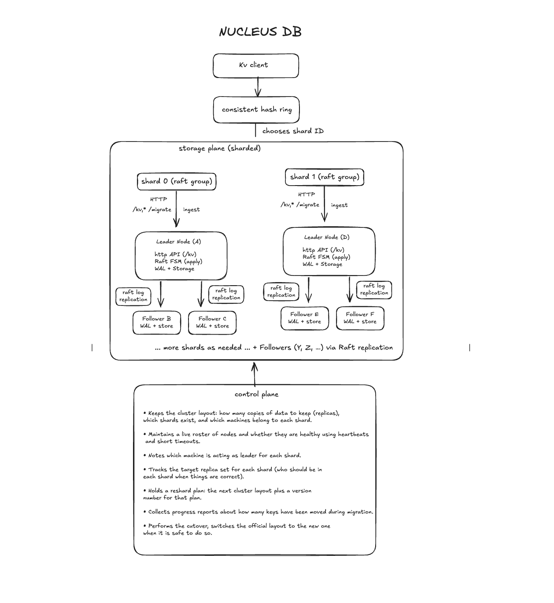

## Nucleus‑DB

Nucleus‑DB is a simple, distributed key‑value store built for learning and experimentation. It splits the key space across multiple shards, replicates data within each shard for fault‑tolerance, and supports online resharding and rebalancing. The goal is to provide a functioning, minimal system that demonstrates how partitioning, replication, hashing, and consensus can work together without hiding the implementation behind abstractions.

## Overview

At its core, Nucleus‑DB is built on three ideas: partitioning, replication, and consistency. Instead of storing all data on a single machine, keys are assigned to shards using a consistent hash ring. Each shard is a self‑contained group managed by a consensus protocol (Raft). Within a shard, there is one leader handling writes, and multiple replicas (followers) that replicate the state. This design gives you linearizable writes and safe failover. Because shards are independent, the system can scale horizontally more shards means more capacity. You can also rebalance or change shard membership when needed, by migrating only the keys that need to move.

If you think in terms of the CAP theorem, each shard in Nucleus‑DB prioritizes Consistency and Partition tolerance (CP). When a majority of replicas are healthy, you get strong consistency. If the shard loses quorum, it will stop accepting writes, favoring safety over availability for that shard.




Nucleus‑DB consists of two major parts:
	•	Storage Nodes (Shards): Each shard runs as a Raft group. One node is leader, the rest are followers. The leader exposes HTTP endpoints for key-value operations. Behind the scenes, every operation is appended to a Raft log, replicated to a majority, and applied to an in-memory store (with write-ahead log and optional snapshotting).
	•	Control Plane: A separate process that maintains cluster-wide metadata: which shards exist, which nodes belong to each shard, which nodes are alive, and who leads each shard. The control plane also accepts reshard plans and coordinates layout changes. It is the source of truth for cluster membership and shard configuration.

When a storage node starts, it registers with the control plane and sends heartbeats so the control plane knows it’s alive. Clients don’t talk directly to the control plane, they hash their key, look up which shard that key belongs to, then send their request to one of the nodes in that shard (preferably the leader).


## Basic Operations

PUT(key, value)

```
Client -> compute hash(key) -> shard-id  
        -> send write request to shard leader  
        -> leader appends to Raft log, replicates to followers  
        -> after commit, value is stored and leader acknowledges  
```

This ensures that once the write returns success, all future reads (from the leader) will see it. Even if the leader fails later, Raft guarantees that the value is not lost (assuming a majority remains).

GET(key)
```
Client -> compute hash(key) -> shard-id  
        -> send read request to leader (or optionally a follower)  
        -> respond with current value  
```

By default reads go to the leader for fresh, linearizable data. Optionally, you can read from a follower for lower latency at the cost of possible staleness.

## Design Principles

Partitioning uses consistent hashing: when the number or arrangement of shards changes, only the keys whose hash maps to affected shards move. This minimizes data migration overhead and supports dynamic scaling.

Replication leverages Raft, so each shard has strong consistency, ordered writes, and automatic leader election on failure.

Resharding is handled as a full‑cluster operation but executed incrementally by individual shard leaders. A reshard plan describes a new layout. Leaders inspect their local data, identify which keys need to move based on the new ring, and send them to the rightful new shard leader. After migration completes, a cutover finalizes the new layout. During this process the system stays online because only affected keys are being moved.

## How to run

Follow instruction in [Testing.md](Testing.md) to spin up the control plane, nodes and perform the basic operations.
